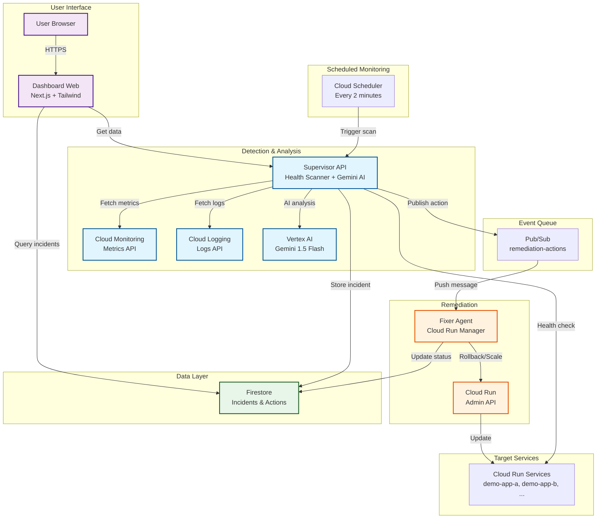
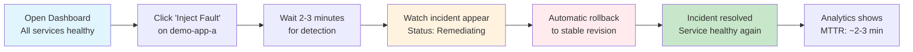
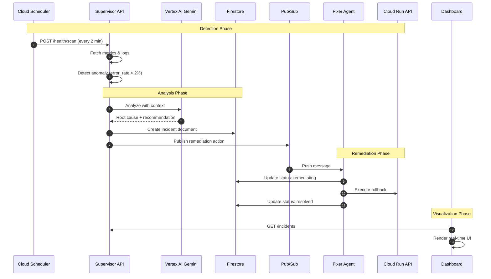

# AgentOps - AI-Powered Cloud Run Auto-Remediation

[](https://opensource.org/licenses/MIT)
[](https://cloud.google.com/run)
[](https://cloud.google.com/vertex-ai)

AgentOps is an intelligent, AI-powered control plane that monitors Google Cloud Run services, detects anomalies using Gemini AI, and automatically executes remediation actions—reducing Mean Time To Recovery (MTTR) from 15-30 minutes to under 3 minutes.

## 🎯 Problem Statement

**Current Challenge**: When Cloud Run services experience issues (error spikes, latency problems, resource exhaustion), teams face:
- ⏱️ **Slow Response**: 15-30 minutes average MTTR for manual incident response
- 🌙 **24/7 Burden**: Engineers must be on-call to handle common, predictable issues
- 💸 **Revenue Loss**: Every minute of downtime costs money
- 🔥 **Human Error**: Manual remediation under pressure is error-prone
- 📊 **Limited Context**: Engineers must manually correlate metrics, logs, and deployment history

**AgentOps Solution**: Autonomous, AI-powered remediation system that:
- 🤖 Detects anomalies in real-time using Cloud Monitoring
- 🧠 Analyzes root cause with Gemini 1.5 Flash AI
- ⚡ Executes remediation automatically (rollback, scaling)
- 📈 Reduces MTTR by 90% (from 15-30 min to <3 min)
- 🔒 Provides complete audit trail for compliance
- 💰 Saves engineering time and reduces revenue loss

## ✨ Key Features

### Core Capabilities
- **🔍 Real-time Monitoring**: Continuous health scanning using Cloud Monitoring API
- **🧠 AI-Powered Analysis**: Gemini 1.5 Flash analyzes metrics, logs, and deployment history
- **🔄 Automated Remediation**: Executes rollbacks to stable revisions and scaling adjustments
- **📊 Live Dashboard**: React-based dashboard with real-time service health visualization
- **⚡ Event-Driven Architecture**: Pub/Sub-based async processing for scalability
- **🗄️ Incident Persistence**: Complete audit trail in Firestore with MTTR tracking
- **🎯 Fault Injection**: Built-in testing capabilities for reliable demonstrations

### Innovation Highlights
- **Contextual AI Analysis**: Not just rule-based thresholds—Gemini analyzes full context
- **Confidence Scoring**: AI provides confidence levels for recommendations (0.0-1.0)
- **Closed-Loop System**: Detect → Analyze → Act → Verify automatically
- **Production-Ready**: Safety limits, dry-run mode, service account security
- **Cloud Run Native**: Revision-aware rollback, traffic splitting, metadata integration

## 🏗️ System Architecture

### High-Level Overview



[📖 **View Detailed Architecture**](docs/architecture-overview.md) | [📊 **View Incident Flow**](docs/incident-flow.md) | [🎬 **View Demo Scenarios**](docs/demo-flow.md)

## 📊 Services Overview

| Service | Technology | Port | Purpose |
|---------|-----------|------|---------|
| **supervisor-api** | Python FastAPI | 8080 | Health monitoring, AI analysis, incident creation |
| **fixer-agent** | Python FastAPI | 8080 | Remediation execution, Cloud Run API integration |
| **dashboard-web** | Next.js 14, React, Tailwind | 3000 | Real-time visualization and monitoring |
| **demo-app-a** | Python FastAPI | 8080 | Test service with fault injection endpoints |
| **demo-app-b** | Node.js Express | 8080 | Test service with fault injection endpoints |

### GCP Services Integration

- **Cloud Run**: Serverless container hosting for all services
- **Cloud Scheduler**: Triggers health scans every 2 minutes
- **Cloud Monitoring**: Metrics API for error rates, latency, request counts
- **Cloud Logging**: Log aggregation and error tracking
- **Vertex AI**: Gemini 1.5 Flash for intelligent root cause analysis
- **Pub/Sub**: Async event messaging for remediation actions
- **Firestore**: NoSQL database for incident persistence and audit trail

## 🚀 Quick Start

### Prerequisites

- **Google Cloud Project** with billing enabled
- **gcloud CLI** installed and authenticated
- **PowerShell** (Windows) or **Bash** (Linux/Mac)
- **Node.js 18+** (for local dashboard development)
- **Python 3.11+** (for local API development)

### One-Command Deployment

```powershell
# Windows PowerShell
git clone https://github.com/YOUR_USERNAME/agentops.git
cd agentops

# Set your GCP project
$env:PROJECT_ID = "your-project-id"
$env:REGION = "us-central1"

# Setup GCP infrastructure (APIs, service accounts, Pub/Sub, Firestore)
cd infra\scripts
.\setup-gcp.ps1

# Deploy all services to Cloud Run
.\deploy-all.ps1

# Open the dashboard
$DASHBOARD_URL = (gcloud run services describe dashboard-web --region=$env:REGION --format='value(status.url)')
Start-Process $DASHBOARD_URL
```

```bash
# Linux/Mac
git clone https://github.com/YOUR_USERNAME/agentops.git
cd agentops

# Set your GCP project
export PROJECT_ID="your-project-id"
export REGION="us-central1"

# Setup and deploy
cd infra/scripts
./setup-gcp.sh
./deploy-all.sh

# Open the dashboard
DASHBOARD_URL=$(gcloud run services describe dashboard-web --region=$REGION --format='value(status.url)')
open $DASHBOARD_URL
```

[📖 **Detailed Deployment Guide**](agentops/apps/supervisor-api/README.md#deployment) | [🔧 **Configuration Options**](.env.template)

## 🎬 Demo: Test the System

### Scenario 1: High Error Rate Detection & Automatic Rollback



#### Step-by-Step Demo Instructions

1. **Open Dashboard**: Navigate to your dashboard URL (shown after deployment)
   - All services should show 🟢 Healthy status
   - No incidents in the Recent Incidents section

2. **Inject Fault**: Click the "Inject Fault" button on `demo-app-a`
   - Service will start returning 500 errors for 50% of requests
   - Error rate will spike from ~0.2% to ~5.2%

3. **Wait for Detection** (~2-3 minutes): Cloud Scheduler triggers next scan
   - Service card turns 🟡 Yellow (Warning)
   - Incident appears: "High Error Rate Detected"
   - Status shows: 🔄 Remediating

4. **Watch Automatic Remediation**:
   - Gemini AI analyzes: "Recent deployment correlates with error spike"
   - Recommendation: "Rollback to previous revision" (Confidence: 87%)
   - Fixer Agent executes rollback to stable revision
   - Verification: Error rate drops back to ~0.3%

5. **View Results**:
   - Incident status changes to ✅ Resolved
   - Service card returns to 🟢 Healthy
   - MTTR displayed: ~2-3 minutes
   - Analytics dashboard shows success rate: 100%

6. **Explore Details**: Click the incident card to see:
   - Complete AI explanation with root cause analysis
   - Timeline of all actions taken
   - Metrics graph showing error rate spike and recovery
   - Error logs that triggered detection

[📖 **Complete Demo Guide**](docs/demo-flow.md) | [🎥 **Video Demo**](#video-demo)

### Expected Results

**Before AgentOps** (Manual Response):
- ⏱️ Detection time: 5-10 minutes (someone notices)
- 🔍 Analysis time: 5-15 minutes (investigate logs, metrics)
- 🛠️ Remediation time: 5-10 minutes (rollback execution)
- **Total MTTR: 15-30 minutes**

**With AgentOps** (Automated):
- ⏱️ Detection time: 2-3 minutes (scheduled scan)
- 🔍 Analysis time: 5 seconds (Gemini AI)
- 🛠️ Remediation time: 30 seconds (automatic rollback)
- **Total MTTR: ~3 minutes** ⚡

**Impact: 90% reduction in MTTR**

## 📊 Dashboard Features

### Real-Time Monitoring
- **Service Health Cards**: Color-coded cards showing error rate, latency P95, and request count
- **Status Indicators**: 🟢 Healthy, 🟡 Warning, 🔴 Critical with threshold-based coloring
- **Auto-Refresh**: Dashboard polls every 10 seconds for real-time updates
- **Manual Scan**: "Trigger Scan" button for immediate health check

### Incident Management
- **Incident Timeline**: Recent incidents with AI recommendations and confidence scores
- **Status Tracking**: Action Pending → Remediating → Resolved/Failed
- **MTTR Display**: Automatic calculation of Mean Time To Recovery
- **Incident Details Modal**: Click any incident to see:
  - Complete AI explanation with root cause
  - Full timeline of actions taken
  - Metrics graphs showing anomaly
  - Error logs that triggered detection
  - Remediation actions executed

### Analytics Dashboard
- **Summary Stats**: Total incidents, resolved, failed, pending counts
- **Performance Metrics**: Average MTTR, action success rate with progress bar
- **Incidents by Service**: Interactive bar chart (Recharts) showing distribution
- **Trend Analysis**: Historical data for optimization insights

### UI/UX Features
- **🌙 Dark Mode**: Toggle with localStorage persistence
- **📱 Responsive Design**: Mobile (1 col), Tablet (2 col), Desktop (3 col) layouts
- **✨ Loading Skeletons**: Shimmer animation during data fetch
- **🎨 Smooth Animations**: Framer Motion for modal slide-in transitions
- **🎨 Custom Theme**: Tailwind CSS with health-based color system

## 🔄 How It Works

### Complete Incident Remediation Flow



[📖 **Detailed Sequence Diagram**](docs/incident-flow.md)

### Key Components Explained

#### 1. Health Scanner (Supervisor API)
- Fetches metrics from Cloud Monitoring (error_rate, latency_p95, request_count)
- Reads error logs from Cloud Logging
- Compares against configurable thresholds
- Detects anomalies based on patterns

#### 2. Gemini Reasoner (Supervisor API)
- Gathers context: metrics, logs, recent deployments, service configuration
- Sends to Vertex AI Gemini 1.5 Flash with structured prompt
- AI analyzes root cause and recommends action
- Returns confidence score (0.0-1.0) and human-readable explanation

#### 3. Firestore Client (Supervisor API)
- Creates incident document with full context
- Tracks incident lifecycle with timestamps
- Calculates MTTR automatically on resolution
- Provides audit trail for compliance

#### 4. Pub/Sub Publisher (Supervisor API)
- Publishes remediation action as JSON message
- Decouples detection from execution
- Enables async, scalable processing

#### 5. Cloud Run Manager (Fixer Agent)
- Receives Pub/Sub push notification
- Executes rollback by shifting traffic to stable revision
- Executes scaling by adjusting min/max instances
- Verifies success by checking metrics after action

#### 6. Dashboard (Next.js)
- Polls supervisor-api every 10 seconds
- Displays service health with color-coded cards
- Shows incident timeline with AI recommendations
- Provides analytics dashboard with charts

## 🛠️ Configuration

### Environment Variables

Edit `.env` file or use Cloud Run environment variables:

```bash
# GCP Configuration
PROJECT_ID=your-project-id
REGION=us-central1

# Monitoring Thresholds
ERROR_THRESHOLD=2.0                # Error rate % threshold
LATENCY_P95_THRESHOLD_MS=1000      # Latency P95 in milliseconds
SCAN_LOOKBACK_MINUTES=5            # Time window for metrics

# Target Services
TARGET_SERVICES=demo-app-a,demo-app-b,your-service

# Firestore Collections
INCIDENTS_COLLECTION=incidents
ACTIONS_COLLECTION=actions

# AI Configuration
GEMINI_MODEL=gemini-1.5-flash-002
GEMINI_TEMPERATURE=0.2             # Lower = more deterministic

# Remediation Safety
MIN_INSTANCES_FLOOR=0              # Minimum allowed min_instances
MIN_INSTANCES_CEILING=5            # Maximum allowed min_instances
MAX_INSTANCES_FLOOR=10             # Minimum allowed max_instances
MAX_INSTANCES_CEILING=100          # Maximum allowed max_instances
DRY_RUN_MODE=false                 # Set true to simulate without executing

# Dashboard Configuration
NEXT_PUBLIC_SUPERVISOR_API_URL=https://supervisor-api-xxx.run.app
NEXT_PUBLIC_PROJECT_ID=your-project-id
```

[📖 **Complete Configuration Reference**](.env.template)

## 💰 Cost Analysis

### Estimated Monthly Costs (Demo Usage)

| Service | Usage | Cost |
|---------|-------|------|
| **Cloud Run** | 5 services × 720 requests/day | ~$5/month |
| **Cloud Scheduler** | 1 job × 720 runs/day | $0.10/month |
| **Cloud Monitoring** | 5 services × metrics API calls | $2/month |
| **Cloud Logging** | 5 services × log ingestion | $1/month |
| **Vertex AI (Gemini)** | ~100 prompts/month @ $0.0002/prompt | $0.02/month |
| **Pub/Sub** | ~100 messages/month | $0.10/month |
| **Firestore** | ~100 documents × storage + reads | $1/month |
| **Total** | | **~$10/month** |

> **Note**: Actual costs depend on:
> - Number of services monitored
> - Scan frequency (default: 2 minutes)
> - Incident frequency
> - Dashboard traffic

### Cost Optimization Tips

- Use `min_instances: 0` for non-critical services (demo apps)
- Increase scan interval if real-time detection not needed
- Use Cloud Run's generous free tier (2 million requests/month)
- Monitor actual usage in GCP Console → Billing

### ROI Calculation

**Scenario**: 1 production incident per week
- Manual response: 20 min engineer time @ $100/hr = **$33.33/incident**
- AgentOps: 3 min automated + 5 min verification = **$13.33/incident**
- **Savings**: $20/incident × 4 incidents/month = **$80/month**
- **Net savings**: $80 - $10 = **$70/month**

Plus: Reduced downtime, improved reliability, eliminated 3am pages.

## 📚 Documentation

### Getting Started
- [📖 **Quick Start Guide**](#quick-start) - Deploy in 10 minutes
- [📖 **Demo Scenarios**](docs/demo-flow.md) - Step-by-step test cases

### Architecture
- [🏗️ **System Architecture**](docs/architecture-overview.md) - Complete system design
- [📊 **Incident Flow**](docs/incident-flow.md) - Detailed sequence diagrams
- [🔄 **State Transitions**](docs/incident-flow.md#state-transitions) - Incident lifecycle

### Component Documentation
- [📖 **Supervisor API**](agentops/apps/supervisor-api/README.md) - 900+ lines, API reference
- [📖 **Fixer Agent**](agentops/apps/fixer-agent/README.md) - 1000+ lines, safety features
- [📖 **Dashboard Web**](agentops/apps/dashboard-web/README.md) - UI components, features

### Configuration & Deployment
- [⚙️ **Environment Variables**](.env.template) - Complete configuration reference
- [🚀 **Deployment Scripts**](infra/scripts/) - Automated setup and deployment

## 🧪 Testing

### Manual Testing

```powershell
# Test supervisor health
Invoke-RestMethod -Uri "https://supervisor-api-xxx.run.app/health"

# Trigger manual scan
Invoke-RestMethod -Method Post -Uri "https://supervisor-api-xxx.run.app/health/scan"

# Inject 5xx errors (50% error rate for 5 minutes)
Invoke-RestMethod -Method Post -Uri "https://demo-app-a-xxx.run.app/fault/enable?type=5xx&error_rate=50&duration=300"

# Inject latency (2 second delay for 5 minutes)
Invoke-RestMethod -Method Post -Uri "https://demo-app-b-xxx.run.app/fault/enable?type=latency&delay_ms=2000&duration=300"

# Clear fault
Invoke-RestMethod -Method Post -Uri "https://demo-app-a-xxx.run.app/fault/clear"
```

### Verification Checklist

- [ ] All services show "Healthy" in dashboard
- [ ] Fault injection triggers detection within 2-3 minutes
- [ ] Incident appears with AI recommendation
- [ ] Status changes: Action Pending → Remediating → Resolved
- [ ] Service returns to healthy after remediation
- [ ] MTTR is calculated and displayed
- [ ] Analytics dashboard shows correct counts
- [ ] Incident details modal shows complete timeline
- [ ] Dark mode toggle works and persists

## 🎥 Video Demo

> **[▶️ Watch 3-Minute Demo](https://youtube.com/placeholder)** (Coming Soon)

Demo covers:
1. Healthy dashboard overview (0:00-0:30)
2. Fault injection (0:30-0:45)
3. Automatic detection (0:45-1:30)
4. AI analysis and recommendation (1:30-2:00)
5. Automatic remediation (2:00-2:30)
6. Analytics and verification (2:30-3:00)

## 🏆 Why AgentOps for Google Cloud Run?

### Innovation
- **AI-Powered Intelligence**: Not just rule-based thresholds—contextual analysis with Gemini
- **Confidence Scoring**: Transparent AI decision-making with explainability
- **Cloud Run Native**: Revision-aware rollback unique to Cloud Run architecture
- **Closed-Loop Automation**: Complete detect → analyze → act → verify cycle

### Production-Ready
- **Safety Controls**: Min/max instance limits, dry-run mode, confidence thresholds
- **Audit Trail**: Complete incident history in Firestore for compliance
- **Security**: Service accounts with least privilege IAM, non-root containers
- **Observability**: Structured logging, metrics, and tracing throughout

### Developer Experience
- **One-Command Deployment**: Automated setup and deployment scripts
- **Built-in Testing**: Fault injection endpoints for reliable demonstrations
- **Real-Time Visibility**: Live dashboard with 10-second refresh
- **Comprehensive Docs**: 3000+ lines of documentation across components

### Real-World Impact
- **90% MTTR Reduction**: From 15-30 minutes to <3 minutes
- **Cost Savings**: Eliminates manual incident response labor
- **Improved Reliability**: Faster recovery means less downtime
- **Reduced On-Call Burden**: Handles common issues automatically

## 🧹 Cleanup

### Option 1: Delete Deployed Services

```powershell
cd infra\scripts
.\teardown.ps1
```

### Option 2: Delete Entire Project

```powershell
gcloud projects delete $env:PROJECT_ID
```

## 🤝 Contributing

Contributions welcome! Please:
1. Fork the repository
2. Create a feature branch
3. Commit your changes
4. Open a pull request

See [CONTRIBUTING.md](CONTRIBUTING.md) for guidelines.

## 📄 License

MIT License - See [LICENSE](LICENSE) file for details.

## 🙏 Acknowledgments

- **Google Cloud Platform**: Cloud Run, Vertex AI, and serverless infrastructure
- **Gemini AI**: Intelligent root cause analysis and recommendations
- **FastAPI**: High-performance Python web framework
- **Next.js**: React framework for the dashboard
- **Tailwind CSS**: Utility-first CSS framework
- **Recharts**: React charting library
- **Framer Motion**: React animation library

## 📞 Support

- **Issues**: [GitHub Issues](https://github.com/YOUR_USERNAME/agentops/issues)
- **Documentation**: [docs/](docs/)
- **Email**: your.email@example.com

---

**🏆 Built for Google Cloud Run Hackathon 2025**

**⭐ Star this repo if you find it useful!**
