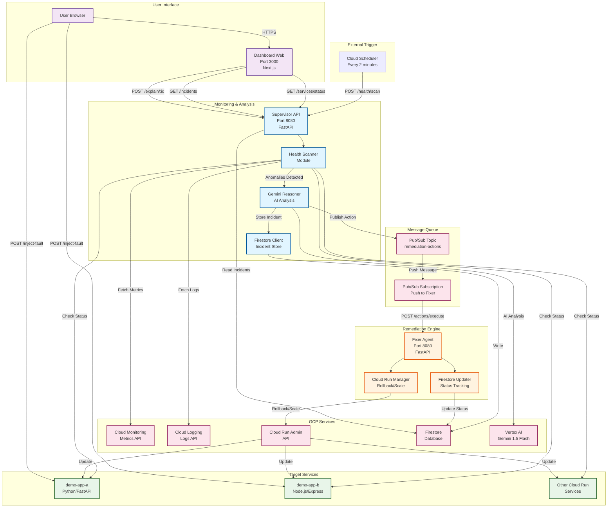

# AgentOps System Architecture

## High-Level Architecture Diagram

## Component Descriptions

### 1. Supervisor API (Monitoring & Analysis)
- **Technology**: Python FastAPI
- **Port**: 8080
- **Purpose**: Continuous health monitoring and AI-powered analysis
- **Key Modules**:
  - **Health Scanner**: Fetches metrics from Cloud Monitoring and logs from Cloud Logging
  - **Gemini Reasoner**: Uses Vertex AI Gemini 1.5 Flash for root cause analysis
  - **Firestore Client**: Persists incidents with full context
  - **Pub/Sub Publisher**: Triggers remediation actions

### 2. Fixer Agent (Remediation Engine)
- **Technology**: Python FastAPI
- **Port**: 8080
- **Purpose**: Executes remediation actions on Cloud Run services
- **Key Modules**:
  - **Cloud Run Manager**: Handles rollback to previous revisions and scaling adjustments
  - **Firestore Updater**: Tracks incident lifecycle (action_pending → remediating → resolved/failed)
  - **Action Executor**: Receives Pub/Sub messages and executes actions

### 3. Dashboard Web (User Interface)
- **Technology**: Next.js 14, React, Tailwind CSS
- **Port**: 3000
- **Purpose**: Real-time visualization and monitoring
- **Key Features**:
  - Service health cards with color-coded metrics
  - Incident timeline with AI recommendations
  - Analytics dashboard with charts (Recharts)
  - Dark mode support
  - Incident details modal with slide-in animation (Framer Motion)

### 4. Demo Apps (Test Services)
- **demo-app-a**: Python FastAPI with fault injection endpoints
- **demo-app-b**: Node.js Express with fault injection endpoints
- **Purpose**: Reliable testing and demonstration of auto-remediation

### 5. GCP Services Integration

| Service | Purpose | Usage |
|---------|---------|-------|
| **Cloud Run** | Hosting all services | Serverless container platform |
| **Cloud Scheduler** | Trigger scans | POST to supervisor-api every 2 minutes |
| **Cloud Monitoring** | Metrics collection | Error rates, latency, request counts |
| **Cloud Logging** | Log aggregation | Error logs, stack traces |
| **Firestore** | Data persistence | Incidents, actions, audit trail |
| **Pub/Sub** | Event messaging | Async remediation triggering |
| **Vertex AI** | AI analysis | Gemini 1.5 Flash for root cause analysis |

## Data Flow Summary

### Detection Phase
1. Cloud Scheduler triggers supervisor-api every 2 minutes
2. Health Scanner fetches metrics and logs for all services
3. Anomaly detection compares against thresholds
4. If anomaly detected → proceed to Analysis Phase

### Analysis Phase
1. Gemini Reasoner gathers context (metrics, logs, revision history)
2. Sends context to Vertex AI Gemini 1.5 Flash
3. AI returns root cause analysis and recommended action
4. Incident created in Firestore with full context
5. Pub/Sub message published with action details

### Remediation Phase
1. Pub/Sub pushes message to fixer-agent endpoint
2. Fixer Agent updates incident status to "remediating"
3. Cloud Run Manager executes action (rollback or scale)
4. Action result captured and logged
5. Incident status updated to "resolved" or "failed"
6. MTTR (Mean Time To Recovery) calculated

### Visualization Phase
1. Dashboard polls supervisor-api every 10 seconds
2. Fetches service status and recent incidents
3. Displays real-time health cards
4. Shows incident timeline with AI recommendations
5. Analytics dashboard shows MTTR and success rate

## Scalability & Reliability

- **Stateless Services**: All components are stateless, enabling horizontal scaling
- **Async Processing**: Pub/Sub decouples detection from remediation
- **Idempotent Actions**: Remediation actions can be safely retried
- **Audit Trail**: Complete incident history in Firestore
- **Safety Controls**: Min/max instance limits, dry-run mode, confidence thresholds
