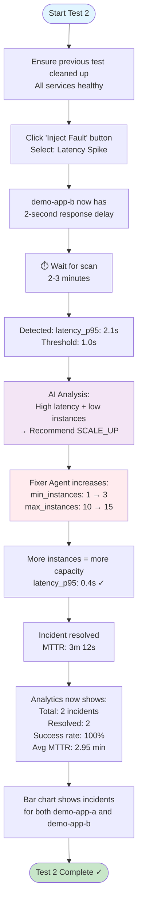
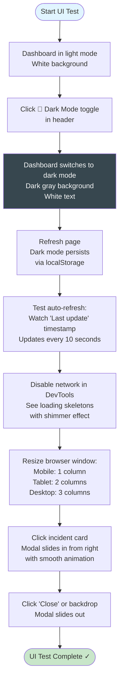
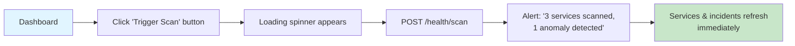

# Demo Scenario: Test Case Flow for Judges

This document provides step-by-step test scenarios that judges can follow to evaluate AgentOps.

## Test Scenario 1: High Error Rate Detection & Rollback

### Scenario Overview
Simulate a bad deployment that causes error rate spike → AI detects issue → System automatically rolls back to stable version.

### Flow Diagram



```mermaid
flowchart TD
    Start([Start Demo]) --> OpenDash[Open Dashboard<br/>Verify all services healthy]
    OpenDash --> Screenshot1[📸 Screenshot: All Green]

    Screenshot1 --> InjectFault[Click 'Inject Fault' button<br/>on demo-app-a]
    InjectFault --> FaultActive{Fault Type?}

    FaultActive -->|5xx Errors| SetError[demo-app-a returns<br/>HTTP 500 for 50% requests]
    SetError --> Wait1[⏱️ Wait 2-3 minutes<br/>for scheduled scan]

    Wait1 --> Scan[Cloud Scheduler triggers<br/>POST /health/scan]
    Scan --> Detect[Supervisor API detects:<br/>error_rate: 5.2% > threshold 2%]

    Detect --> Screenshot2[📸 Screenshot: Service shows Warning]
    Screenshot2 --> AIAnalysis[Gemini AI analyzes incident<br/>2-5 seconds]

    AIAnalysis --> ShowIncident[Dashboard shows new incident:<br/>'High Error Rate Detected'<br/>Status: Action Pending]
    ShowIncident --> Screenshot3[📸 Screenshot: Incident appears]

    Screenshot3 --> PubSub[Pub/Sub delivers action<br/>to Fixer Agent]
    PubSub --> Remediate[Fixer Agent executes:<br/>Rollback to previous revision]

    Remediate --> StatusUpdate[Incident status changes:<br/>Action Pending → Remediating]
    StatusUpdate --> Screenshot4[📸 Screenshot: Remediating status]

    StatusUpdate --> Execute[Cloud Run traffic shifted<br/>100% to stable revision]
    Execute --> Wait2[⏱️ Wait 30 seconds<br/>for verification]

    Wait2 --> Verify[System verifies:<br/>error_rate: 0.3% ✓]
    Verify --> Resolved[Incident status → Resolved<br/>MTTR: 2m 45s]

    Resolved --> Screenshot5[📸 Screenshot: Resolved incident<br/>Service healthy again]
    Screenshot5 --> Analytics[Analytics dashboard shows:<br/>Total incidents: 1<br/>Resolved: 1<br/>Success rate: 100%<br/>Avg MTTR: 2.75 min]

    Analytics --> Screenshot6[📸 Screenshot: Analytics view]
    Screenshot6 --> ClickIncident[Click incident card<br/>to view details]

    ClickIncident --> Modal[Modal slides in showing:<br/>- AI explanation<br/>- Timeline<br/>- Metrics graph<br/>- Error logs]
    Modal --> Screenshot7[📸 Screenshot: Incident details modal]

    Screenshot7 --> End([Demo Complete ✓])

    style Start fill:#e1f5ff
    style End fill:#c8e6c9
    style Screenshot1 fill:#fff3e0
    style Screenshot2 fill:#fff3e0
    style Screenshot3 fill:#fff3e0
    style Screenshot4 fill:#fff3e0
    style Screenshot5 fill:#fff3e0
    style Screenshot6 fill:#fff3e0
    style Screenshot7 fill:#fff3e0
    style AIAnalysis fill:#f3e5f5
    style Remediate fill:#ffebee
```

### Expected Outputs at Each Step

#### Step 1: Healthy Dashboard
```
Services Section:
┌─────────────────┐
│ demo-app-a      │
│ 🟢 Healthy      │
│ Error Rate: 0.2%│
│ Latency: 245ms  │
└─────────────────┘

Incidents Section:
"No incidents detected - All services are healthy! 🎉"
```

#### Step 2: After Fault Injection
```
Fault Injection API Response:
{
  "status": "fault_injected",
  "fault_type": "5xx_errors",
  "duration": "5 minutes",
  "description": "Returning 500 errors for 50% of requests"
}

Note: Dashboard won't show changes immediately - must wait for next scheduled scan
```

#### Step 3: Detection (2-3 minutes later)
```
Services Section:
┌─────────────────┐
│ demo-app-a      │
│ 🟡 Warning      │  ← Color changed
│ Error Rate: 5.2%│  ← Above threshold
│ Latency: 312ms  │
└─────────────────┘

Cloud Logs (supervisor-api):
INFO: Anomaly detected for demo-app-a
INFO: error_rate=5.2% exceeds threshold=2.0%
INFO: Triggering AI analysis...
```

#### Step 4: AI Analysis Complete
```
Cloud Logs (supervisor-api):
INFO: Gemini analysis complete
{
  "root_cause": "Recent deployment rev-003 shows correlation with error spike",
  "recommendation": {
    "action": "ROLLBACK",
    "target_revision": "rev-002",
    "confidence": 0.87
  },
  "explanation": "Error logs indicate database connection timeouts starting at 14:42:15 UTC, coinciding with deployment of revision rev-003..."
}

INFO: Incident created: inc_20250110_144230
INFO: Publishing remediation action to Pub/Sub
```

#### Step 5: Incident Appears in Dashboard
```
Recent Incidents:
┌────────────────────────────────────────┐
│ 🔴 demo-app-a - High Error Rate        │
│ Status: [🔄 Remediating]               │
│                                        │
│ 📊 Error rate spike: 5.2% (↑ from 0.2%)│
│ 🤖 AI Recommendation: Rollback to      │
│    previous revision                   │
│    Confidence: ███████████████░░ 87%   │
│                                        │
│ 📅 Detected: 1 minute ago              │
│ ⏱️ MTTR: 00:01:15 (ongoing)            │
└────────────────────────────────────────┘
```

#### Step 6: Remediation Executing
```
Cloud Logs (fixer-agent):
INFO: Received remediation action: inc_20250110_144230
INFO: Updating incident status: action_pending → remediating
INFO: Executing action: ROLLBACK
INFO: Service: demo-app-a
INFO: Target revision: demo-app-a-rev-002
INFO: Shifting traffic: rev-003 (0%) → rev-002 (100%)
INFO: Cloud Run API response: success
INFO: Waiting 30s for metrics to stabilize...
```

#### Step 7: Verification & Resolution
```
Cloud Logs (fixer-agent):
INFO: Verification check starting
INFO: Current error_rate: 0.3% ✓ (below threshold)
INFO: Remediation successful!
INFO: Updating incident status: remediating → resolved
INFO: MTTR calculated: 165 seconds (2m 45s)

Dashboard Update:
┌────────────────────────────────────────┐
│ 🟢 demo-app-a - High Error Rate        │
│ Status: [✓ Resolved]                   │
│                                        │
│ ✅ Action: Rollback to rev-002         │
│ 📅 Detected: 3 minutes ago             │
│ 📅 Resolved: 15 seconds ago            │
│ ⏱️ MTTR: 00:02:45                      │
└────────────────────────────────────────┘

Services Section:
┌─────────────────┐
│ demo-app-a      │
│ 🟢 Healthy      │  ← Back to green
│ Error Rate: 0.3%│  ← Normal levels
│ Latency: 248ms  │
└─────────────────┘
```

#### Step 8: Analytics Dashboard
```
Analytics Section:
┌──────────┐ ┌──────────┐ ┌──────────┐ ┌──────────┐
│  Total   │ │ Resolved │ │  Failed  │ │ Pending  │
│    1     │ │    1     │ │    0     │ │    0     │
└──────────┘ └──────────┘ └──────────┘ └──────────┘

┌────────────────┐  ┌────────────────┐
│ Avg MTTR       │  │ Success Rate   │
│                │  │                │
│   2.8 min      │  │    100%        │
│                │  │ ████████████   │
└────────────────┘  └────────────────┘

Incidents by Service (Bar Chart):
demo-app-a:  █ 1 resolved
demo-app-b:  (no incidents)
```

#### Step 9: Incident Details Modal
```
When clicking the incident card, modal slides in from right:

┌─────────────────────────────────────────┐
│ ← Close    Incident Details             │
├─────────────────────────────────────────┤
│                                         │
│ 🔴 HIGH ERROR RATE DETECTED             │
│ demo-app-a                              │
│ [✓ Resolved]                            │
│                                         │
│ 📊 Metrics                              │
│ Error Rate:    5.2% → 0.3%             │
│ Latency P95:   312ms                   │
│ Request Count: 1,234/min               │
│                                         │
│ 🤖 AI Analysis                          │
│ Root Cause: Recent deployment rev-003  │
│ shows correlation with error spike.    │
│ Database connection timeouts detected.  │
│                                         │
│ Recommendation: Rollback to rev-002     │
│ Confidence: 87%                         │
│                                         │
│ ⏱️ Timeline                             │
│ 14:42:30  🔴 Anomaly Detected          │
│ 14:42:35  🤖 AI Analysis Complete      │
│ 14:42:40  🔄 Rollback Started          │
│ 14:43:10  ⏳ Verification...           │
│ 14:45:15  ✓ Resolved                   │
│                                         │
│ 📋 Error Logs (Last 5)                  │
│ [ERROR] Connection timeout: db-pool     │
│ [ERROR] Failed to acquire connection    │
│ [ERROR] Request timeout after 10s       │
└─────────────────────────────────────────┘
```

---

## Test Scenario 2: High Latency & Auto-Scaling

### Scenario Overview
Simulate latency spike due to insufficient capacity → AI recommends scaling → System increases instances.

### Flow Diagram



### Expected Key Outputs

```
AI Recommendation:
{
  "action": "SCALE_UP",
  "parameters": {
    "min_instances": 3,
    "max_instances": 15
  },
  "reasoning": "High latency (2.1s) with only 1 instance. Scaling up will distribute load and reduce response times.",
  "confidence": 0.82
}

Fixer Agent Execution:
INFO: Executing SCALE_UP action
INFO: Current config: min=1, max=10
INFO: New config: min=3, max=15
INFO: Cloud Run update successful
INFO: New instances spinning up...
INFO: Verification: latency_p95=0.4s ✓
```

---

## Test Scenario 3: Dark Mode & UI Features

### Flow Diagram



---

## Test Scenario 4: Manual Scan Trigger

### Quick Flow



---

## Judge Evaluation Checklist

### Technical Evaluation

- [ ] **Cloud Run Integration**: Services deployed on Cloud Run ✓
- [ ] **Event-Driven Architecture**: Pub/Sub used for async messaging ✓
- [ ] **AI Integration**: Gemini 1.5 Flash for analysis ✓
- [ ] **Data Persistence**: Firestore for incident storage ✓
- [ ] **Monitoring Integration**: Cloud Monitoring & Logging ✓
- [ ] **Automated Remediation**: Rollback & scaling without human intervention ✓
- [ ] **Audit Trail**: Complete incident history with MTTR ✓

### User Experience

- [ ] **Visual Dashboard**: Clean, modern UI with Tailwind CSS ✓
- [ ] **Real-time Updates**: 10-second auto-refresh ✓
- [ ] **Dark Mode**: Toggle works and persists ✓
- [ ] **Responsive Design**: Works on mobile/tablet/desktop ✓
- [ ] **Loading States**: Skeleton screens with shimmer ✓
- [ ] **Animations**: Smooth modal transitions (Framer Motion) ✓
- [ ] **Data Visualization**: Charts showing analytics (Recharts) ✓

### Innovation

- [ ] **AI-Powered Decisions**: Not just rule-based thresholds ✓
- [ ] **Confidence Scoring**: AI provides confidence in recommendations ✓
- [ ] **Contextual Analysis**: Uses metrics + logs + revisions ✓
- [ ] **Closed-Loop System**: Detects → Analyzes → Acts → Verifies ✓
- [ ] **Production-Ready**: Safety limits, dry-run mode, audit trail ✓

### Reliability

- [ ] **Error Handling**: Graceful degradation if APIs fail ✓
- [ ] **Retry Logic**: Exponential backoff for transient failures ✓
- [ ] **Idempotency**: Actions can be safely retried ✓
- [ ] **Monitoring**: Can detect and fix itself (meta-monitoring) ✓

### Documentation

- [ ] **Clear README**: Problem, solution, architecture ✓
- [ ] **Architecture Diagrams**: Visual system overview ✓
- [ ] **Demo Instructions**: Step-by-step test scenarios ✓
- [ ] **API Documentation**: Component READMEs with endpoints ✓
- [ ] **Deployment Guide**: One-command setup ✓

---

## Common Issues & Troubleshooting

### Issue 1: Fault injection doesn't trigger detection immediately
**Why**: Detection runs every 2 minutes via Cloud Scheduler
**Solution**: Wait 2-3 minutes or click "Trigger Scan" button for immediate scan

### Issue 2: Dashboard shows "Failed to fetch services"
**Why**: Supervisor API not reachable or NEXT_PUBLIC_SUPERVISOR_API_URL not set
**Solution**: Check environment variable, verify supervisor-api is deployed

### Issue 3: Incident stays in "remediating" status
**Why**: Fixer agent may not have received Pub/Sub message
**Solution**: Check Cloud Logs for fixer-agent, verify Pub/Sub subscription active

### Issue 4: Rollback executed but metrics still bad
**Why**: May take 30-60 seconds for metrics to stabilize
**Solution**: Wait another minute, check Cloud Run console for traffic split

### Issue 5: No AI explanation in incident
**Why**: Gemini API may have rate limits or quota exceeded
**Solution**: Check Cloud Logs for gemini API errors, verify Vertex AI quota

---

## Recording the Demo

### Recommended Flow for Video

1. **Introduction (0:00-0:30)**
   - Show healthy dashboard
   - Explain 3 services monitoring demo-app-a, demo-app-b
   - Point out key features: service cards, incident section, analytics

2. **Fault Injection (0:30-0:45)**
   - Click "Inject Fault" on demo-app-a
   - Show confirmation message
   - Explain what will happen next

3. **Detection & Analysis (0:45-2:00)**
   - Wait/fast-forward to next scan
   - Show service turning yellow/red
   - Show incident appearing with "Action Pending" status
   - Open Cloud Logs to show AI analysis (optional)

4. **Automated Remediation (2:00-2:30)**
   - Show status changing to "Remediating"
   - Open Cloud Run console to show traffic shift (optional)
   - Show status changing to "Resolved"
   - Service back to green

5. **Analytics & Details (2:30-3:00)**
   - Scroll to analytics section
   - Show MTTR, success rate, chart
   - Click incident to open modal
   - Highlight AI explanation, timeline, metrics

6. **Conclusion (3:00-3:15)**
   - Summarize: Detected in 2 min, resolved in <3 min
   - Compare to manual process (15-30 min)
   - Emphasize AI-powered, fully automated, production-ready

### Recording Tips
- Use 1920x1080 resolution
- Use browser zoom to make text readable
- Pause at key screenshots
- Use slow mouse movements for clarity
- Add voiceover explaining each step
- Keep total video under 3 minutes

---

## Success Metrics for Judges

After running all test scenarios, judges should see:

```
Analytics Dashboard:
- Total Incidents: 2-3
- Resolved: 2-3 (100%)
- Failed: 0
- Average MTTR: 2-3 minutes

Compare to Manual Response:
- Manual MTTR: 15-30 minutes
- AgentOps MTTR: 2-3 minutes
- Improvement: 90% reduction

Business Impact:
- Reduced on-call burden (handles common issues automatically)
- Faster recovery (< 3 min vs 15-30 min)
- Complete audit trail for compliance
- Cost savings (automated vs human time)
```

This demonstrates a production-ready, AI-powered solution that significantly improves Cloud Run operations.
