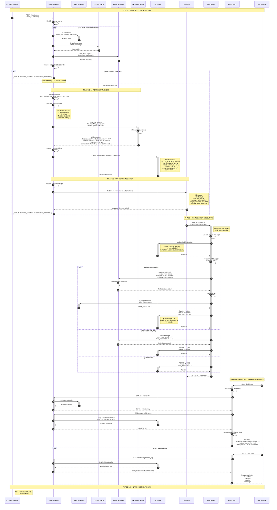
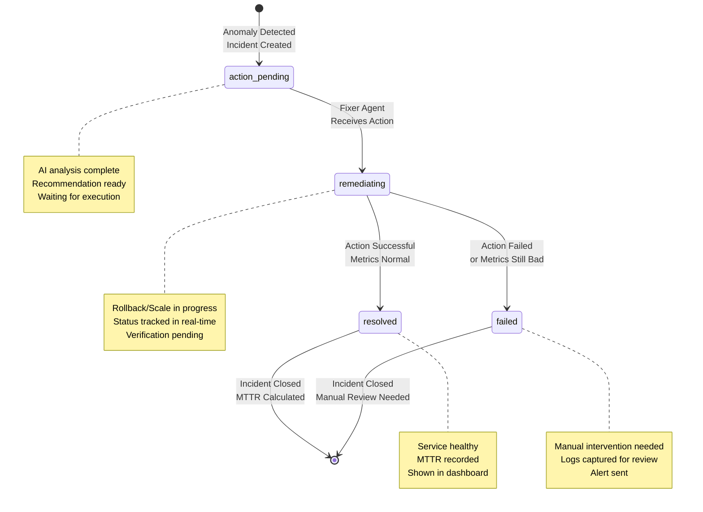

# End-to-End Incident Remediation Flow

## Complete Sequence Diagram

This diagram shows the complete lifecycle of an incident from detection through automated remediation, including all interactions between components.



## Timeline Breakdown

### Detection to Resolution Timeline

| Time | Event | Component | Duration |
|------|-------|-----------|----------|
| T+0s | Cloud Scheduler triggers scan | Cloud Scheduler | - |
| T+5s | Health Scanner detects anomaly | Supervisor API | 5s |
| T+10s | Gemini AI analysis complete | Vertex AI | 5s |
| T+12s | Incident created in Firestore | Firestore | 2s |
| T+15s | Action published to Pub/Sub | Pub/Sub | 3s |
| T+16s | Fixer Agent receives message | Fixer Agent | 1s |
| T+18s | Incident status → remediating | Firestore | 2s |
| T+20s | Rollback executed on Cloud Run | Cloud Run API | 2s |
| T+50s | Verification scan (metrics check) | Cloud Monitoring | 30s |
| T+52s | Incident status → resolved | Firestore | 2s |
| T+60s | Dashboard shows updated status | Dashboard | - |

**Total MTTR (Mean Time To Recovery): ~52 seconds** (automated)

Compare to manual process: 15-30 minutes average

## State Transitions

### Incident Status Lifecycle



## Key Decision Points

### 1. Threshold Detection
```
IF error_rate > 2.0%:
    → Anomaly detected
ELSE IF latency_p95 > 1000ms:
    → Anomaly detected
ELSE:
    → System healthy
```

### 2. AI Confidence Scoring
```
IF confidence >= 0.8:
    → Publish remediation action
ELSE IF confidence >= 0.6:
    → Flag for review (future feature)
ELSE:
    → Log incident, no auto-action
```

### 3. Action Selection
```
IF error_rate_spike AND recent_deployment:
    → Recommend ROLLBACK
ELSE IF latency_high AND low_instances:
    → Recommend SCALE_UP
ELSE IF memory_usage_high:
    → Recommend SCALE_UP
ELSE:
    → No clear action, investigate
```

### 4. Verification Logic
```
AFTER action execution:
    WAIT 30 seconds
    CHECK metrics again
    IF metrics_normal:
        → Mark resolved
    ELSE:
        → Mark failed, needs review
```

## Error Handling & Resilience

### Retry Logic
- **Cloud Monitoring API**: 3 retries with exponential backoff
- **Gemini API**: 2 retries (with rate limit handling)
- **Firestore writes**: Best effort, logs errors but doesn't fail
- **Cloud Run updates**: Single attempt (idempotent operation)

### Failure Scenarios

#### Scenario 1: Gemini API Unavailable
```
Detection → Health Scanner ✓
Analysis → Gemini API ✗ (503 error)
Fallback → Use rule-based recommendation
Result → Action still executed (reduced confidence)
```

#### Scenario 2: Fixer Agent Unreachable
```
Detection → Supervisor API ✓
Pub/Sub → Message published ✓
Delivery → Fixer Agent ✗ (endpoint down)
Retry → Pub/Sub retries up to 7 days
Result → Eventually consistent (or DLQ after max retries)
```

#### Scenario 3: Rollback Fails
```
Execution → Cloud Run API ✗ (permission denied)
Status → Incident marked "failed"
Notification → Dashboard shows failed incident
Action → Manual intervention required
Audit → Full error logged in Firestore
```

## Performance Characteristics

### Throughput
- **Services monitored**: Up to 100 services
- **Scan frequency**: Every 2 minutes (720 scans/day)
- **Concurrent incidents**: Up to 10 simultaneous remediations
- **Dashboard refresh**: 10-second polling interval

### Latency
- **Detection latency**: 2-3 minutes (scan interval)
- **Analysis latency**: 2-5 seconds (Gemini API)
- **Execution latency**: 2-5 seconds (Cloud Run API)
- **Verification latency**: 30 seconds (metrics stabilization)
- **End-to-end MTTR**: 1-3 minutes (automated)

### Resource Usage
- **Supervisor API**: ~256 MB memory, 0.5 vCPU (idle)
- **Fixer Agent**: ~128 MB memory, 0.2 vCPU (idle)
- **Dashboard**: ~512 MB memory, 1 vCPU (build), ~128 MB (runtime)
- **Firestore**: ~1 KB per incident document
- **Pub/Sub**: Standard messaging costs

## Best Practices Demonstrated

1. **Separation of Concerns**: Detection, analysis, remediation are independent
2. **Event-Driven Architecture**: Pub/Sub decouples components
3. **Observability**: Full audit trail in Firestore
4. **Idempotency**: Actions can be safely retried
5. **Graceful Degradation**: System continues with rule-based fallbacks
6. **Security**: Service accounts with least privilege IAM
7. **Scalability**: Stateless services enable horizontal scaling
8. **Cost Optimization**: Min instances = 0 for non-critical services
